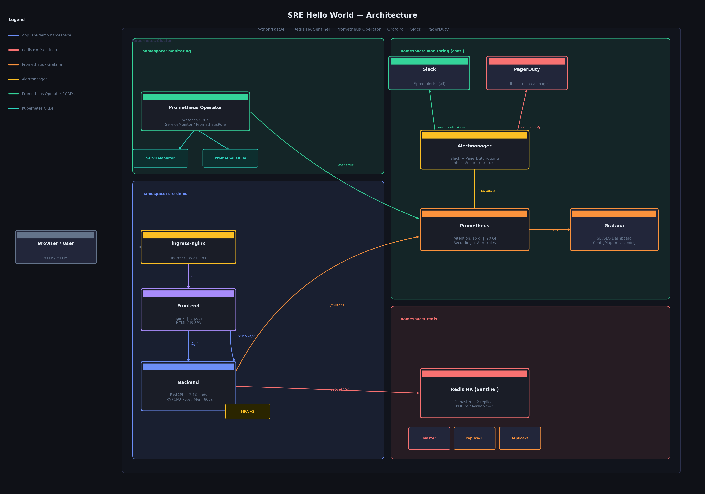

# SRE Hello World



A production-grade demo of SRE fundamentals — **SLIs, SLOs, error budgets, and multi-burn-rate alerting** — built with Python/FastAPI, Redis, and Prometheus.

- **Backend** — FastAPI, exposes `/metrics` (Prometheus), full Redis CRUD, SLO simulation endpoints
- **Frontend** — nginx + vanilla JS SPA: key-value store, live SLO dashboard, Redis stats
- **Store** — Redis 7 (standalone for local dev, HA Sentinel for Kubernetes)
- **Observability** — Prometheus recording rules, multi-burn-rate SLO alerts, Grafana dashboard, Slack + PagerDuty alerting

---

## Repository Layout

```
SRE-Hello-World/
├── backend/                        # FastAPI application
│   ├── app.py
│   ├── requirements.txt
│   └── Dockerfile
├── frontend/                       # nginx + single-file HTML/JS SPA
│   ├── index.html
│   ├── nginx.conf
│   └── Dockerfile
├── monitoring/                     # Observability stack (see monitoring/README.md)
│   ├── README.md                   ← detailed monitoring setup guide
│   ├── kube-prometheus-stack-values.yaml
│   ├── alertmanager-config.yaml
│   ├── alertmanager-secret.yaml
│   ├── grafana-dashboard-configmap.yaml
│   ├── grafana-dashboards/
│   │   └── sre-hello-world.json
│   └── prometheus.yml              # docker-compose only
├── helm/
│   ├── sre-hello-world/            # App Helm chart
│   │   ├── Chart.yaml
│   │   ├── values.yaml
│   │   └── templates/
│   │       ├── backend-deployment.yaml
│   │       ├── backend-service.yaml
│   │       ├── frontend-deployment.yaml
│   │       ├── frontend-service.yaml
│   │       ├── ingress.yaml
│   │       ├── configmap.yaml
│   │       ├── hpa.yaml
│   │       ├── servicemonitor.yaml
│   │       └── prometheusrule.yaml
│   └── redis-ha-values.yaml        # Bitnami Redis HA Sentinel overrides
└── docker-compose.yml
```

---

## Local Development (Docker Compose)

### Prerequisites

| Tool | Version |
|------|---------|
| Docker | 24+ |
| Docker Compose | v2 |

### Build and Run

```bash
git clone <repo-url>
cd SRE-Hello-World

# Build images and start the full stack
docker compose up --build
```

| Service | URL | Credentials |
|---------|-----|-------------|
| Frontend UI | http://localhost | — |
| Backend API | http://localhost:8000 | — |
| Prometheus | http://localhost:9090 | — |
| Grafana | http://localhost:3000 | admin / admin |

To override default passwords, create a `.env` file before starting:

```bash
cat > .env <<EOF
REDIS_PASSWORD=mysecretpassword
GRAFANA_PASSWORD=mygrafanapassword
EOF

docker compose up --build
```

### Smoke Test

```bash
# Health check
curl http://localhost:8000/health

# Set a key
curl -X POST http://localhost:8000/api/keys \
  -H 'Content-Type: application/json' \
  -d '{"key":"hello","value":"world","ttl":300}'

# Read it back
curl http://localhost:8000/api/keys/hello

# View Prometheus metrics
curl http://localhost:8000/metrics

# Burn the error budget (triggers SLO alerts in ~1 min)
for i in $(seq 1 50); do
  curl -s "http://localhost:8000/api/simulate/error?rate=1.0" &
done; wait

# Trigger a latency breach
for i in $(seq 1 10); do
  curl -s "http://localhost:8000/api/simulate/slow?delay=3.0" &
done; wait
```

### Stop

```bash
docker compose down          # stop containers, keep volumes
docker compose down -v       # stop and delete volumes (wipes Redis data)
```

---

## Kubernetes Deployment

### Prerequisites

| Requirement | Check |
|-------------|-------|
| Kubernetes 1.28+ | `kubectl cluster-info` |
| Helm 3.14+ | `helm version` |
| `ingress-nginx` installed | `kubectl get ingressclass nginx` |
| `kube-prometheus-stack` installed | `kubectl get crd prometheuses.monitoring.coreos.com` |
| A container registry to push images to | — |
| A default StorageClass for PVCs | `kubectl get storageclass` |

#### Install ingress-nginx (if missing)

```bash
helm repo add ingress-nginx https://kubernetes.github.io/ingress-nginx
helm repo update
helm install ingress-nginx ingress-nginx/ingress-nginx \
  -n ingress-nginx --create-namespace
```

#### Install kube-prometheus-stack (if missing)

See **[monitoring/README.md](monitoring/README.md)** for the full setup guide, including Slack and PagerDuty configuration.

```bash
helm repo add prometheus-community https://prometheus-community.github.io/helm-charts
helm repo update
helm install kube-prometheus-stack prometheus-community/kube-prometheus-stack \
  -n monitoring --create-namespace \
  --version 66.x \
  -f monitoring/kube-prometheus-stack-values.yaml
kubectl get pods -n monitoring -w
```

---

### Step 1 — Build and Push Docker Images

```bash
export REGISTRY=your-registry.io/your-org   # e.g. ghcr.io/myorg
export TAG=1.0.0

docker build -t ${REGISTRY}/sre-hello-world-backend:${TAG}  ./backend
docker build -t ${REGISTRY}/sre-hello-world-frontend:${TAG} ./frontend

docker push ${REGISTRY}/sre-hello-world-backend:${TAG}
docker push ${REGISTRY}/sre-hello-world-frontend:${TAG}
```

---

### Step 2 — Deploy Redis HA (Sentinel)

```bash
helm repo add bitnami https://charts.bitnami.com/bitnami
helm repo update

# Create namespace and password secret
kubectl create namespace redis

kubectl create secret generic redis-secret \
  --from-literal=redis-password='YourStrongPasswordHere' \
  -n redis

# Install: 1 master + 2 replicas + Sentinel + PDB
helm install redis bitnami/redis \
  -n redis \
  --version 20.x \
  -f helm/redis-ha-values.yaml

# Wait for all 3 pods (master + 2 replicas) to be Running
kubectl get pods -n redis -w
```

Verify Sentinel is healthy:

```bash
kubectl run redis-test --rm -it --restart=Never --image=redis:7-alpine -- \
  redis-cli -h redis.redis.svc.cluster.local -p 26379 \
  -a YourStrongPasswordHere sentinel masters
# Expected: master name "mymaster", flags "master", num-slaves "2"
```

---

### Step 3 — Create the App Namespace and Secrets

```bash
kubectl create namespace sre-demo

# Copy Redis secret into the app namespace
kubectl get secret redis-secret -n redis -o yaml \
  | sed 's/namespace: redis/namespace: sre-demo/' \
  | kubectl apply -f -

# Alertmanager credentials (Slack + PagerDuty) — see monitoring/README.md §Step 2
kubectl create secret generic alertmanager-slack-secret \
  --from-literal=webhook-url='https://hooks.slack.com/services/T.../B.../..' \
  -n sre-demo

kubectl create secret generic alertmanager-pagerduty-secret \
  --from-literal=routing-key='your-32-char-pd-integration-key' \
  -n sre-demo
```

---

### Step 4 — Deploy the App Helm Chart

```bash
helm install sre-hello-world helm/sre-hello-world \
  -n sre-demo \
  --set backend.image.repository=${REGISTRY}/sre-hello-world-backend \
  --set backend.image.tag=${TAG} \
  --set frontend.image.repository=${REGISTRY}/sre-hello-world-frontend \
  --set frontend.image.tag=${TAG} \
  --set ingress.host=sre-hello-world.example.com

# Verify all pods are Running
kubectl get pods,svc,ingress -n sre-demo
```

The chart deploys:
- Backend Deployment (2 replicas, HPA 2–10, rolling update)
- Frontend Deployment (2 replicas, rolling update)
- `ServiceMonitor` — Prometheus scrapes `/metrics` every 30 s
- `PrometheusRule` — recording rules + multi-burn-rate SLO alerts

---

### Step 5 — Apply Monitoring Config

```bash
# Alert routing: all alerts → Slack #prod-alerts, critical → PagerDuty + Slack
kubectl apply -f monitoring/alertmanager-config.yaml -n sre-demo

# Grafana SLO dashboard (auto-loaded by the sidecar)
kubectl apply -f monitoring/grafana-dashboard-configmap.yaml -n monitoring
```

---

### Step 6 — Verify

```bash
# App health
kubectl port-forward svc/sre-hello-world-frontend 8080:80 -n sre-demo
curl http://localhost:8080/health
# {"status":"healthy","redis":"connected"}

# Prometheus: targets and rules
kubectl port-forward svc/kube-prometheus-stack-prometheus 9090:9090 -n monitoring
# http://localhost:9090/targets  → sre-hello-world-backend  State: UP
# http://localhost:9090/rules    → group: sre-hello-world.recording
# http://localhost:9090/alerts   → AvailabilitySLOFastBurn, LatencyP99SLOBreach (Inactive)

# Grafana dashboard
kubectl port-forward svc/kube-prometheus-stack-grafana 3000:80 -n monitoring
# http://localhost:3000  →  Dashboards → SRE → "SRE Hello World — SLI/SLO"
```

---

### Upgrade

```bash
# New image version
helm upgrade sre-hello-world helm/sre-hello-world \
  -n sre-demo \
  --set backend.image.tag=1.1.0 \
  --set frontend.image.tag=1.1.0

# Watch rollout
kubectl rollout status deployment/sre-hello-world-backend -n sre-demo
```

### Rollback

```bash
helm rollback sre-hello-world -n sre-demo         # one revision back
helm rollback sre-hello-world 2 -n sre-demo       # specific revision
helm history sre-hello-world -n sre-demo          # list revisions
```

### Tear Down

```bash
helm uninstall sre-hello-world -n sre-demo
helm uninstall redis            -n redis
helm uninstall kube-prometheus-stack -n monitoring

kubectl delete namespace sre-demo redis monitoring
```

---

## SLI / SLO Reference

| SLO | Target | Error Budget (30 d) | Alert |
|-----|--------|--------------------:|-------|
| Availability | ≥ 99.9 % | 43.2 min | `AvailabilitySLOFastBurn` (critical), `AvailabilitySLOSlowBurn` (warning) |
| P95 Latency | ≤ 200 ms | 5 % of requests | `LatencyP95SLOBreach` (warning) |
| P99 Latency | ≤ 500 ms | 1 % of requests | `LatencyP99SLOBreach` (critical) |
| Error Rate | ≤ 0.1 % | 0.1 % of requests | subsumed by Availability alerts |

Alert strategy follows [SRE Workbook Chapter 5](https://sre.google/workbook/alerting-on-slos/):
- **Fast burn** — 14.4× rate over 1 h window → pages on-call immediately
- **Slow burn** — 1× rate over 6 h window → files a ticket

See [monitoring/README.md](monitoring/README.md) for the complete observability setup, PromQL queries, and Grafana dashboard reference.

---

## Backend Environment Variables

| Variable | Default | Description |
|----------|---------|-------------|
| `REDIS_HOST` | `localhost` | Redis host (direct mode) |
| `REDIS_PORT` | `6379` | Redis port |
| `REDIS_PASSWORD` | — | Redis auth password |
| `REDIS_SENTINEL_HOSTS` | — | Comma-separated `host:port` list — enables Sentinel mode |
| `REDIS_SENTINEL_SERVICE` | `mymaster` | Sentinel master set name |
| `ENVIRONMENT` | `development` | Exposed in `app_info` metric |
| `APP_VERSION` | `1.0.0` | Exposed in `app_info` metric |
